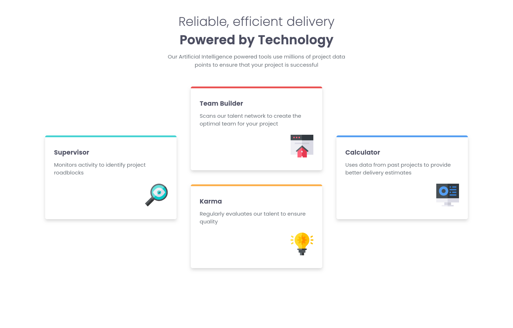
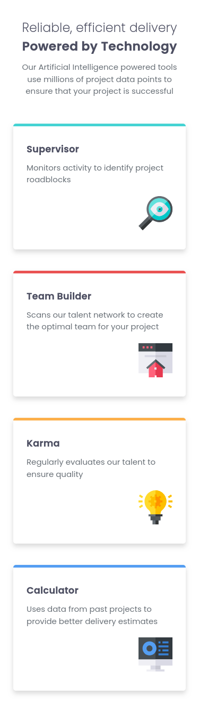

# Frontend Mentor - Four card feature section solution

This is a solution to the [Four card feature section challenge on Frontend Mentor](https://www.frontendmentor.io/challenges/four-card-feature-section-weK1eFYK). Frontend Mentor challenges help you improve your coding skills by building realistic projects. 

## Table of contents

- [Frontend Mentor - Four card feature section solution](#frontend-mentor---four-card-feature-section-solution)
  - [Table of contents](#table-of-contents)
  - [Overview](#overview)
    - [The challenge](#the-challenge)
    - [Screenshot](#screenshot)
    - [Links](#links)
  - [My process](#my-process)
    - [Built with](#built-with)
    - [What I learned](#what-i-learned)
    - [Continued development](#continued-development)
    - [Useful resources](#useful-resources)
    - [AI Collaboration](#ai-collaboration)
  - [Author](#author)

## Overview

### The challenge

Users should be able to:

- View the optimal layout for the site depending on their device's screen size

### Screenshot




### Links

- Solution URL: [https://github.com/juanhastier/four-card-feature-section](https://github.com/juanhastier/four-card-feature-section)
- Live Site URL: [https://juanhastier.github.io/four-card-feature-section](https://juanhastier.github.io/four-card-feature-section)

## My process

### Built with

- Semantic HTML5 markup
- CSS custom properties
- Flexbox
- Mobile-first workflow

### What I learned

I really liked this project because I learned about accessibility, using the attributes (alt="" and role="presentation") of an image to make the image purely decorative:

```html

```

### Continued development

For now, I would like to continue my learning path at Frontend Mentor and thus solve increasingly complex challenges.

### Useful resources

- [MDN](https://developer.mozilla.org/en-US/) - TI really enjoyed studying on MDN, and I will continue to use it in the future.
- [CSS Tricks: CSS Flexbox Layout Guide](https://css-tricks.com/snippets/css/a-guide-to-flexbox/) - This is an amazing article which helped me finally understand flexbox layout. I'd recommend it to anyone still learning this concept.
- [CSS Tricks: CSS Grid Layout Guide](https://css-tricks.com/complete-guide-css-grid-layout/) - This is an amazing article which helped me finally understand grid layout. I'd recommend it to anyone still learning this concept.

### AI Collaboration

Use AI for accessibility in this project. Make the images purely decorative. And that he give me an explanation of the meaning of the semantic attributes used and why it was necessary.

## Author

- Frontend Mentor - [@juanhastier](https://www.frontendmentor.io/profile/juanhastier)
